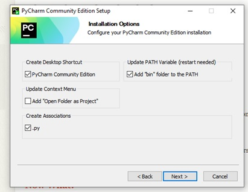
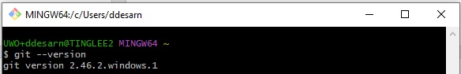
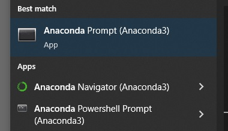
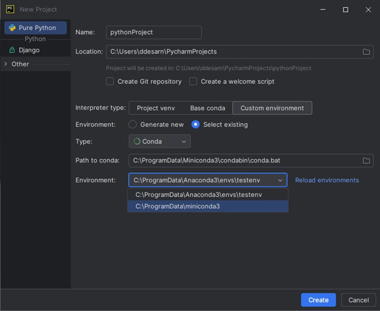
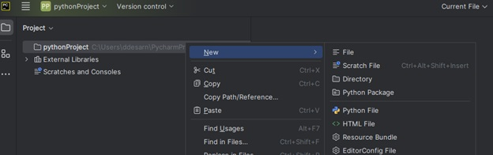
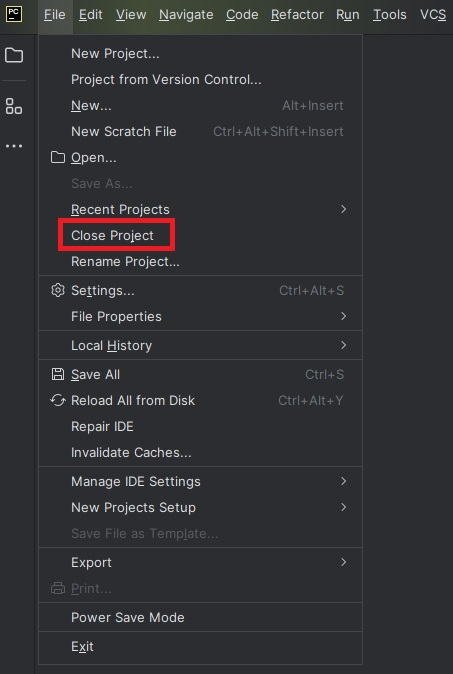
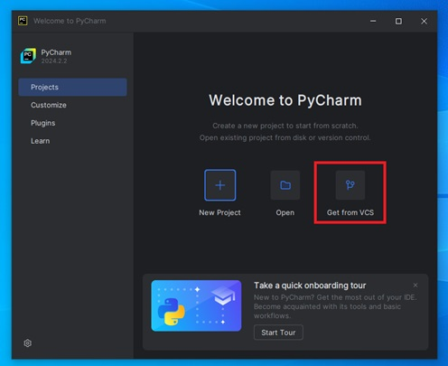
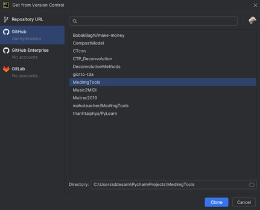
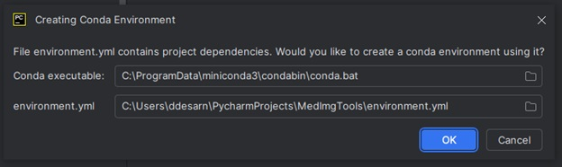

# Repository Description

This repo was intended for Medical Biophysics students or people who are interested in medical image processing, attempting to start from the basics for those who are looking to work with Python.

# Simple Python Setup

After doing things by hand in different programming scenarios, below is a setup that I have used and recommended for ease-of-use Python programming. The general outline will be downloading and installing followed by a quick startup guide:

0. Resources
1. Install Anaconda for package management and virtual environments
2. Install our IDE
3. Installing Git
4. Setting up a virtual environment and using PyCharm
5. Cloning a Github repository in PyCharm
6. Github

# 0. Resources

- Here is an incredible resource for learning Python:
  https://www.w3schools.com/python/ 
- Before starting the setup, if you want to start coding in Python, a great resource that I use constantly in my day-to-day to test how exactly the outputs of functions behave is an online Python interpreter
  https://www.programiz.com/python-programming/online-compiler/ 
- Another resource for seeing how code is executed line by line is the following:
  https://cscircles.cemc.uwaterloo.ca/visualize
- Github student developer pack (requires student sign up) is a great resource for learning several available tools https://education.github.com/pack

# 1. Install Anaconda

Anaconda gives us access to the ‘conda’ package and environment manager which makes the use of virtual environments significantly easier. There is a navigator, but I wouldn’t recommend it. Default installation options are fine. \
https://docs.anaconda.com/distro-or-miniconda/ 

# 2. Install PyCharm Community

Many integrated development environments (IDE’s) will have the functionalities we will be covering in this setup guide. Other common IDE’s will be Visual Studio Code, Spyder, Sublime, Jupyter, etc. \
https://www.jetbrains.com/pycharm/download/?section=windows \

# 3. Git and setup a Github account

Git's main purpose is for file version control and Github allows users to privately or openly upload their code to a repository; improving collaboration and easier reproducibility. Default installation selections are fine. 
https://git-scm.com/downloads 
 

We can launch <strong>Git bash</strong> from our Windows to test that it is properly installed with the following command: 
<code>git --version</code>

# 4. Getting Started – virtual environments, and PyCharm

We downloaded and installed various things, but what are any of them for? What is a virtual environment? What are some tools in PyCharm (and other IDEs) that I should be using in my regular programming process?

<strong>Virtual environments</strong> are independent installations of Python and packages and allow for isolated testing.

Consider the situation where one wants to use an older library that hasn’t been updated with the newest version of Python, then a virtual environment can be set up with an older version without affecting any new Python environments we may have. 

<strong>Setting up our first virtual environment (venv):</strong>

<strong>1.</strong> Navigate to the Anaconda prompt

<strong>*Note</strong>, one has to launch the anaconda prompt as administrator if you chose to install for all users (which requires admin access)

<strong>2.</strong> Create the venv

The general syntax used for commands will be <code>conda</code> followed by other keywords with spaces in between. Let’s create a new virtual environment named <code>testenv</code> with the following:

<code>conda create --name testenv</code>

We can initialize this environment with a specific installation of Python, or even include one or many packages in the initial installation. More resources on the topic: 
https://conda.io/projects/conda/en/latest/user-guide/tasks/manage-environments.html

<strong>3.</strong> Install some packages for our venv

Next, let us use the environment we just created and start to install some packages. We can start by ‘activating’ the environment with

<code>conda activate testenv</code>

To install a package, it is useful to Google the install command, but most of them have the following form

<code>conda install anaconda::numpy</code>

Where the keyword <code>anaconda</code> is where it is downloading the package <code>numpy</code> from. Another common distributor for example is <code>conda-forge</code>.

<strong>3.1</strong> Package installation using Pip

A well-loved package installer called <code>pip</code> can be used by installing it in our environment. 
 We can install it using

<code>conda install anaconda::pip</code>

And can install packages with the syntax <code>pip install PACKAGE_NAME</code>; for example

<code>pip install numpy</code>

<strong>4.</strong> Using our environment in PyCharm

We installed the libraries that we wanted, and now we want to use them in PyCharm. Launch PyCharm and we can start a new project for example. We want to head to <strong>settings</strong> and set up a <strong>project interpreter</strong>. PyCharm will already recognize we have conda and we can navigate to find our testenv.

We will be going over how to clone a repository in section 5.

<strong>5.</strong> Make a new file

We can right click and start our new file using the packages available to us in our conda environment.

<strong>*Note</strong>, if we ever want to get back to our landing page, click the top left <strong>file</strong> and <strong>close project</strong> to return

<strong>6.</strong> Exporting a virtual environment

If we have 100 packages installed in an environment, and we want someone else to test our code, they would need to install those 100 packages at the correct versions. There is a convenient approach for this common problem using either a <strong>environment.yml</strong> or <strong>requirement.txt</strong> file (environment.yml is for conda and requirement.txt is for pip).

If we go back to the Anaconda prompt and activate our environment, we can export or <strong>freeze</strong> the environment using conda with the following

<code>conda activate testenv</code> 
<code>conda env export > environment.yml </code>

<strong>TIP</strong>, this environment file will have very precise information about the packages you have installed beyond the version number. If you want your environment file to work in many more cases, for example, if someone is using a Mac vs Windows, use the following

<code>conda env export --no-builds > environment.yml</code>

The save location will be dependent on the working directory in your anaconda prompt. For example, if the prompt is run as administrator, the directory will be in <code>C:\WINDOWS\System32</code>.

# 5. Cloning a Github repository in PyCharm

Using PyCharm, we are going to be able to clone the repo as well as install the <code>environment.yml</code> to set up our project conveniently and easily. From the landing page, we want to select get from VCS (version control system)

We can then sign in using our Github information, and since we have Git installed, will be able to download and install a repository directly through PyCharm. We can use our own repositories that we have associated with our account or we can use the repository URL from Github. 

My favorite part is that when the repository clones, PyCharm will automatically detect any environment files in the repository being downloaded and ask us if we want to use it as our environment for easy installation.

<strong>Manual environment installation using conda:</strong>

I have tested this on several computers (including Mac) with success, however, in the case that you have a problem we can always install a conda environment using the environments.yml or requirements.txt file using conda or pip respectively. Make sure the environment file is in the working directory of your Anaconda prompt.

<code>conda env create -f environment.yml</code>

Multiple users on the same PC with Anaconda / PyCharm installed seems to have an issue with the "easy environment install" described previously.

# 6. Github

#### 1. Cloning a repository

* Go to the repository main page.
* Above the list of files, click <code> <> </code> Code.

* Copy the HTTPS URL for the repository.

* Open Git Bash or cmd
* Type git clone, and then paste the URL you copied.   <code> git clone https://github.com/docs.git </code>

#### 2. Update your local repo
* Before starting coding in the repo each time, you need chech if you have the las version of the repo and update your local repository by pull command.   <code> git pull </code>
#### 3. Adding new file to the repo
* To add a new file to the repo you can use   <code> git add FileName </code>
* If you are starting new repo, you can use the folowing command to add all files at once   <code> git add . </code>

#### 4. Commiting the changes
* When finishing the work, you will need to commit the changes.
* Commit is considered as save point of the project's currently staged changes.
* To commit your changes, you can use this command   <code> git commit -m "commit message" </code>

#### 5. Uploading the new version of your local repo

* The git push command is used to upload local repository content to a remote repository.   <code> git push origin main </code>

